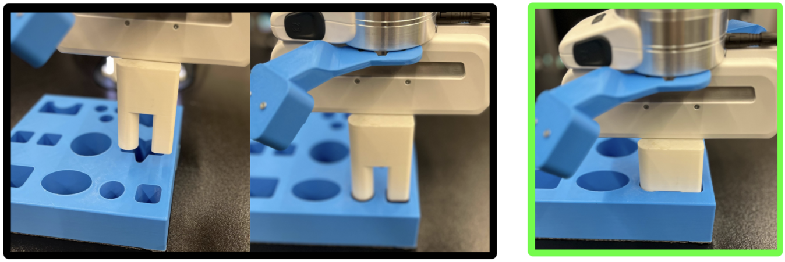

# Run with Franka Arm on Real Robot

We demonstrate how to use SERL with real robot manipulators with 4 different tasks. Namely: Peg Insertion, PCB Component Insertion, Cable Routing, and Object Relocation. We provide detailed instruction on how to reproduce the Peg Insertion task as a setup test for the entire SERL package.

When running with a real robot, a separate gym env is needed. For our examples, we isolated the gym env as a client to a robot server. The robot server is a Flask server that sends commands to the robot via ROS. The gym env communicates with the robot server via post requests.


This requires the installation of the following packages:

- [serl_franka_controller](https://github.com/rail-berkeley/serl_franka_controller)
- `serl_robot_infra`: [readme](serl_robot_infra/README.md)

Follow the README in `serl_robot_infra` for basic robot operation instructions.


*NOTE: The following code will not run as it is, since it will require custom data, checkpoints, and robot env. We provide the code as a reference for how to use SERL with real robots. Learn this section in incremental order, starting from the first task (peg insertion) to the last task (bin relocation). Modify the code according to your needs. *

## Peg Insertion 📍



> Example is located in [examples/async_peg_insert_drq/](../examples/async_peg_insert_drq/)

> Env and default config are located in `serl_robot_infra/franka_env/envs/peg_env/`

> The `franka_env.envs.wrappers.SpacemouseIntervention` gym wrapper provides the ability to intervene the robot with a spacemouse. This is useful for demo collection, testing robot, and making sure the training Gym environment works as intended.

The peg insertion task is best for getting started with running SERL on a real robot. As the policy should converge and achieve 100% success rate within 30 minutes on a single GPU in the simplest case, this task is great for trouble-shooting the setup quickly. The procedure below assumes you have a Franka arm with a Robotiq Hand-E gripper and 2 RealSense D405 cameras.

### Procedure
1. 3D-print (1) **Assembly Object** of choice and (1) corresponding **Assembly Board** from the **Single-Object Manipulation Objects** section of [FMB](https://functional-manipulation-benchmark.github.io/files/index.html). Fix the board to the workspace and grasp the peg with the gripper.
2. 3D-print and install (2) [wrist camera mounts for the RealSense D405](https://serl-robot.github.io/static/files/robotiq_d405_wrist_mount.step) if you are using the Robotiq Hand-E gripper, or (1) [wrist camera mount for the Franka gripper](https://serl-robot.github.io/static/files/franka_d405_wrist_mount.step). Update the camera serial numbers in `REALSENSE_CAMERAS` located in [peg_env/config.py](../serl_robot_infra/franka_env/envs/peg_env/config.py).
3. The reward is given by checking the end-effector pose matches a fixed target pose. Manually move the arm into a pose where the peg is inserted into the board and update the `TARGET_POSE` in [peg_env/config.py](../serl_robot_infra/franka_env/envs/peg_env/config.py) with the measured end-effector pose.
4. Set `RANDOM_RESET` to `False` inside the config file to speedup training. Note the policy would only generalize to any board pose when this is set to `True`, but only try this after the basic task works.
5. Record 20 demo trajectories with the spacemouse.
    ```bash
    python record_demo.py
    ```
    The trajectories are saved in `examples/async_peg_insert_drq/peg_insertion_20_trajs_{UUID}.pkl`.
6. Train the RL agent with the collected demos by running both learner and actor nodes.
    ```bash
    bash run_learner.sh
    bash run_actor.sh
    ```
7. If nothing went wrong, the policy should converge with 100% success rate within 30 minutes without `RANDOM_RESET` and 60 minutes with `RANDOM_RESET`.
8. The checkpoints are automatically saved and can be evaluated with:
    ```bash
    bash run_actor.sh
    ```
    If the policy is trained with `RANDOM_RESET`, it should be able to insert the peg even when you move the board at test time.
